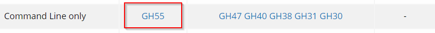

# Erika Version 3 integration

## Warning...
COMPILE만 됨. HW 테스트 진행중

## Introduction
BIFACES환경에서 Erika 3 RTOS 지원

## Necessary Softwares (Not included in this repo)
- Erika3: Erika 웹페이지에서 설치
- Bifaces: download from Infineon (needs a registrion)

## Test Environment
- HW: Aurix TC275 ShieldBuddy
- Compiler: HighTec Free Compiler
- Debugger: Pls UDE as a part of free evluation tool bundle

## Issue
- Erika3에서 iLLD 미사용으로 설정하는 경우 컴파일 문제 발생. iLLD를 사용을 설정. starup과 OsTimer(STM0)는 Starup Code 및 Stm Timer 0는 OS 코드를 사용

## 적용 순서
1. Download Erika3
   http://www.erika-enterprise.com/index.php/download/erika-v3-download.html
    
1. c:\Toolsl\RT-Druid에 설치
1. ErikaOsV3_TC2xx폴더를 Bifaces용 기본 프로젝트 폴더에 복사 (기존 Erika2와 동일)
1. StartBifacesDos.bat 실행
1. make all

## ToDo
- HW Test --> Stm동작 확인완료 (Led Blink)
