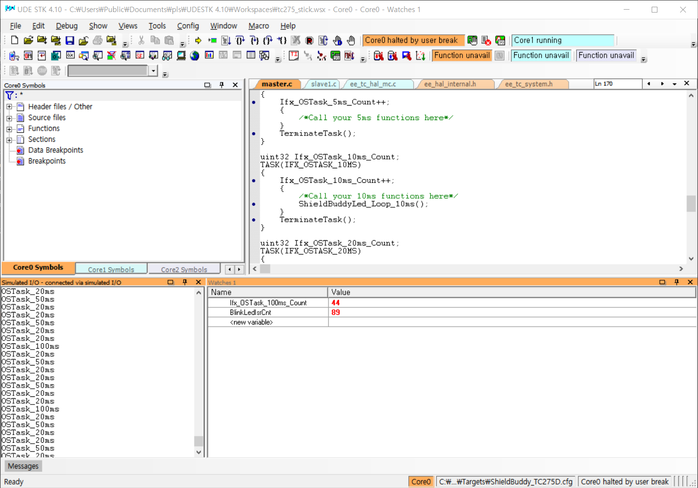

# Erika 3 Integration

## Introduction
BIFACES환경에서 Erika 3 RTOS 지원하기위한 모듈과 Makefile을 제공한다. Erika OS와 BIFACES는 미포함.

## 적용 순서
1. BIFACES, HIGHTEC Compiler 설치
1. Download Erika3
   http://www.erika-enterprise.com/index.php/download/erika-v3-download.html
    
1. Erika3를 c:\Toolsl\RT-Druid에 설치 (현재 Makefile은 이 경로를 사용하고 있음)
1. ErikaOsV3_TC2xx폴더를 Bifaces의 프로젝트에 복사 (BIFACES의 Erika2와 동일 방식)
1. (1_ToolEnv/Config 폴더내의 Config.mk내의 경로 정보 수정)
1. (1_ToolEnv/Config/컴파일러 폴더의 Config_Gnuc.mk내의 컴파일러 경로 정보 수정)
1. StartBifacesDos.bat 실행
1. make all

## 제약 사항
- Erika3에서 iLLD 미사용으로 설정하는 경우 컴파일 문제 발생한다. 항상 iLLD사용으로 설정.
- Starup과 OsTimer(STM0)는 Erika에서 제공되는 코드를 사용

## 기타
- make osclean : OS관련하여 생성된 코드를 삭제함. OIL수정시 실행 권장.

## Test Environment
- HW: Infineon Aurix TC275 ShieldBuddy (https://www.ehitex.de/starter-kits/fuer-aurix/2535/hitex-shieldbuddytc275-aurix-powered-arduino-uno-r3-hardware-compatible-platform)
- Compiler: HighTec Free Compiler
- Debugger: Pls UDE as a part of free evluation tool bundle

## ToDo
- HW 테스트 중: ISR 및 OS timer(Stm)동작 확인완료 (Led Blink)
    
